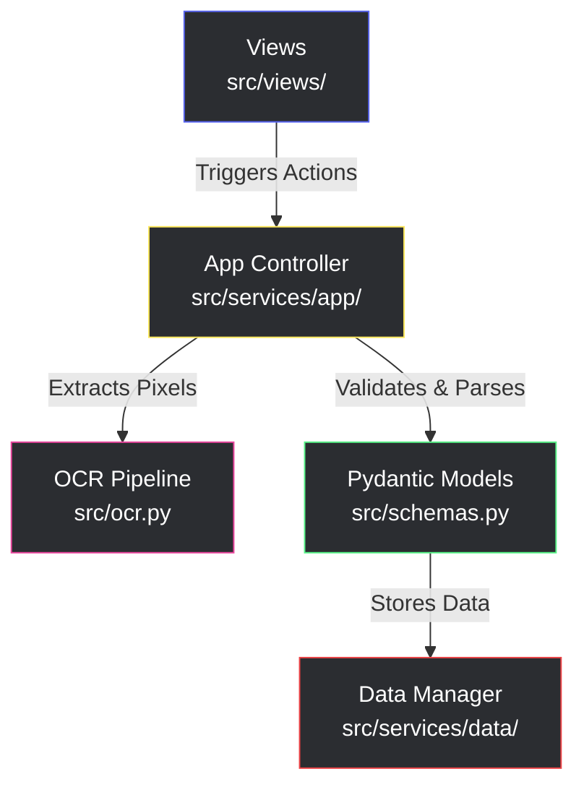

# Gaffer's Clipboard


[](https://github.com/astral-sh/uv)
[](https://github.com/astral-sh/ruff)
[](https://github.com/astral-sh/ty)

> **Note:** This project is currently in Phase 8 (Analytics Engine).

**Gaffer's Clipboard** is a high-fidelity, desktop companion application for EA FC / FIFA Career Mode. It utilizes a custom OpenCV KNN-based OCR engine to extract match and player statistics directly from screenshots, transforming raw pixels into a strictly validated, JSON-backed local database for deep squad analysis.

## Features

* **Zero-Manual Entry OCR:** Extract dozens of player and match stats in seconds using lightweight computer vision (no heavy ML frameworks required).
* **Multi-Career Management:** Complete data isolation for different manager saves (e.g., "Arsenal" vs. "Wrexham").
* **Strict Data Validation:** Powered by **Pydantic V2** (`src/schemas.py`), ensuring every extracted goal, tackle, and injury record is mathematically and logically sound before saving.
* **Resolution Independence:** Dynamically scales OCR regions to support capturing from 1080p, 1440p, and 4K displays.

## The Analytics Engine (Whitepapers)

The player rating system in Gaffer's Clipboard is powered by a custom, mathematically rigorous analytics engine. It completely abandons the "black box" algorithms used by commercial rating apps in favor of transparent, variance-aware statistical models (utilizing Principal Component Analysis and Expected Goals models).

Depending on your technical background, you can read the official documentation on how the engine was built:

* 📄 **[How Gaffer's Clipboard Rates Players](docs/How_Gaffers_Clipboard_Rates_Players.pdf)** *An accessible, high-level executive summary of the rating philosophy and mechanics, designed specifically for EA FC players and football fans.*

* 📐 **[Quantitative Design of the Gaffer's Clipboard Rating Algorithm](docs/Quantitative_Design_of_the_Gaffers_Clipboard_Rating_Algorithm.pdf)** *The comprehensive data science whitepaper detailing the exact linear algebra, standard deviation normalizations, and positional heuristics powering the algorithm.*

## Technical Stack

As defined in our `pyproject.toml`, this project is built on a lean, high-performance stack:

* **Language:** Python 3.13+
* **GUI Framework:** `customtkinter` (Modern, dark-themed UI)
* **Computer Vision & Math:** `opencv-python`, `pillow`, and `numpy`
* **Automation:** `pyautogui` (for screenshot capture)
* **Data Layer:** `pydantic` (Strict type validation)
* **Environment & Tooling:** `uv` (Package Management), `ruff` (Linting/Formatting), and `ty` (Type checking)

<details>
<summary><b>Click to view full dependency tree (uv tree)</b></summary>

```text
gaffers-clipboard v0.7.1
├── customtkinter v5.2.2
│   ├── darkdetect v0.8.0
│   └── packaging v26.0
├── numpy v2.4.2
├── opencv-python v4.13.0.92
│   └── numpy v2.4.2
├── pillow v12.1.1
├── pyautogui v0.9.54
│   ├── mouseinfo v0.1.3
│   │   └── pyperclip v1.11.0
│   ├── pygetwindow v0.0.9
│   │   └── pyrect v0.2.0
│   ├── pymsgbox v2.0.1
│   ├── pyscreeze v1.0.1
│   └── pytweening v1.2.0
├── pydantic v2.12.5
│   ├── annotated-types v0.7.0
│   ├── pydantic-core v2.41.5
│   │   └── typing-extensions v4.15.0
│   ├── typing-extensions v4.15.0
│   └── typing-inspection v0.4.2
│       └── typing-extensions v4.15.0
├── jupyter v1.1.1 (group: dev)
│   ├── ipykernel v7.2.0
│   │   ├── comm v0.2.3
│   │   ├── debugpy v1.8.20
│   │   ├── ipython v9.12.0
│   │   ├── jupyter-core v5.9.1 (*)
│   │   ├── matplotlib-inline v0.2.1 (*)
│   │   ├── nest-asyncio v1.6.0
│   │   ├── packaging v26.0
│   │   ├── psutil v7.2.2
│   │   ├── pyzmq v27.1.0
│   │   ├── tornado v6.5.5
│   │   └── traitlets v5.14.3
│   ├── ipywidgets v8.1.8
│   │   ├── comm v0.2.3
│   │   ├── ipython v9.12.0 (*)
│   │   ├── jupyterlab-widgets v3.0.16
│   │   ├── traitlets v5.14.3
│   │   └── widgetsnbextension v4.0.15
│   ├── jupyter-console v6.6.3
│   │   ├── ipykernel v7.2.0 (*)
│   │   ├── ipython v9.12.0 (*)
│   │   ├── jupyter-client v8.8.0 (*)
│   │   ├── jupyter-core v5.9.1 (*)
│   │   ├── prompt-toolkit v3.0.52 (*)
│   │   ├── pygments v2.20.0
│   │   ├── pyzmq v27.1.0
│   │   └── traitlets v5.14.3
│   ├── jupyterlab v4.5.6
│   │   ├── async-lru v2.3.0
│   │   ├── httpx v0.28.1
│   │   ├── ipykernel v7.2.0 (*)
│   │   ├── jinja2 v3.1.6
│   │   │   └── markupsafe v3.0.3
│   │   ├── jupyter-core v5.9.1 (*)
│   │   ├── jupyter-lsp v2.3.1
│   │   ├── jupyter-server v2.17.0 (*)
│   │   ├── jupyterlab-server v2.28.0
│   │   ├── notebook-shim v0.2.4
│   │   ├── packaging v26.0
│   │   ├── setuptools v82.0.1
│   │   ├── tornado v6.5.5
│   │   └── traitlets v5.14.3
│   ├── nbconvert v7.17.1 (*)
│   └── notebook v7.5.5
│       ├── jupyter-server v2.17.0 (*)
│       ├── jupyterlab v4.5.6 (*)
│       ├── jupyterlab-server v2.28.0 (*)
│       ├── notebook-shim v0.2.4 (*)
│       └── tornado v6.5.5
├── matplotlib v3.10.8 (group: dev)
│   ├── contourpy v1.3.3
│   │   └── numpy v2.4.2
│   ├── cycler v0.12.1
│   ├── fonttools v4.62.1
│   ├── kiwisolver v1.5.0
│   ├── numpy v2.4.2
│   ├── packaging v26.0
│   ├── pillow v12.1.1
│   ├── pyparsing v3.3.2
│   └── python-dateutil v2.9.0.post0 (*)
├── pandas v3.0.2 (group: dev)
│   ├── numpy v2.4.2
│   ├── python-dateutil v2.9.0.post0 (*)
│   └── tzdata v2026.1
├── pytest v9.0.2 (group: dev)
│   ├── colorama v0.4.6
│   ├── iniconfig v2.3.0
│   ├── packaging v26.0
│   ├── pluggy v1.6.0
│   └── pygments v2.20.0
├── pytest-cov v7.1.0 (group: dev)
│   ├── coverage v7.13.5
│   ├── pluggy v1.6.0
│   └── pytest v9.0.2 (*)
├── pytest-mock v3.15.1 (group: dev)
│   └── pytest v9.0.2 (*)
├── ruff v0.15.9 (group: dev)
├── scikit-learn v1.8.0 (group: dev)
│   ├── joblib v1.5.3
│   ├── numpy v2.4.2
│   ├── scipy v1.17.1
│   │   └── numpy v2.4.2
│   └── threadpoolctl v3.6.0
├── scipy v1.17.1 (group: dev) (*)
├── seaborn v0.13.2 (group: dev)
│   ├── matplotlib v3.10.8 (*)
│   ├── numpy v2.4.2
│   └── pandas v3.0.2 (*)
├── statsmodels v0.14.6 (group: dev)
│   ├── numpy v2.4.2
│   ├── packaging v26.0
│   ├── pandas v3.0.2 (*)
│   ├── patsy v1.0.2
│   │   └── numpy v2.4.2
│   └── scipy v1.17.1 (*)
└── ty v0.0.28 (group: dev)
(*) Package tree already displayed
```

</details>

## Getting Started

### Prerequisites

Ensure you have the ultra-fast [uv](https://docs.astral.sh/uv/) package manager installed.

### Installation

1. Clone the repository:

```bash
git clone ["https://github.com/Kaziksobo/Gaffers-Clipboard"](https://github.com/Kaziksobo/Gaffers-Clipboard.git)
cd gaffers-clipboard
```

2. Sync the environment (this installs all main and dev dependencies):

```bash
uv sync
```

### Running the Application

Launch the application using our configured entry point:

```bash
uv run gaffer
```

## Architecture (Strict MVC & Interface-Driven)

As a robust desktop application, this codebase strictly separates state, logic, and presentation using an interface-driven architecture:



* **`src/contracts/`**: Protocol/Interface definitions ensuring loose coupling between the UI, OCR, and Data layers.
* **`src/schemas.py`**: The "Truth" of the data. Strict Pydantic models for Players, Matches, and Career metadata.
* **`src/services/`**:
  * `app/`: Business logic, session buffering, and state orchestration.
  * `data/`: Persistent storage logic (JSON file I/O).
* **`src/views/`**: Pure `customtkinter` frontend frames. **No business logic or data manipulation occurs here.**
* **`src/ocr.py`**: The standalone OpenCV image processing pipeline.

The main application controller is `src/app.py`, which orchestrates interactions between the UI, OCR, and Data layers while maintaining strict separation of concerns. Only this file is allowed to directly interact with the views. Its inner workings are abstracted out to its services (`src/services/app/`) to keep it clean and focused on orchestration, meaning a lot of methods are simply wrappers. Data management is handled by the `DataManager` class directly in `src/data_manager.py`. This is the only class allowed to read/write to disk, with all reads/writes going through its strict, validated Pydantic models. `DataManager` has its own inner workings abstracted out into its own services (`src/services/data/`) to keep it focused solely on data persistence and retrieval, and the instance of `DataManager` is ceated in the app controller's init method and passed around to any service that needs it. This strict separation and interface-driven design allows for maximum maintainability, testability, and future extensibility (e.g., swapping out the OCR engine or adding a new UI framework) without any tight coupling or spaghetti code.

## Development & Testing

I maintain strict quality control using `pytest`, `pytest-cov`, `pytest-mock`, `ruff`, and `ty`.

### Testing

Run the full test suite with coverage reporting:

```bash
uv run pytest --cov=src --cov-report=html
```

### Contributing Standards

All code must pass strict type checking, linting, and formatting before merging. It must also adhere to the strict MVC separation of concerns outlined above.

1. **Type Checking:** I use `ty` to enforce rigorous static typing across the project.

```bash
uv run ty .
```

2. **Linting & Formatting:** I use `ruff` to enforce PEP compliance and maintain a clean codebase.

```bash
# Check for linting errors
uv run ruff check .

# Auto-format code
uv run ruff format .
```

## Roadmap & Planning

I maintain a detailed, living roadmap for this project.

🔗 **[View the full Project Roadmap here](docs/project_roadmap.md)**

> **Tip:** The documentation and roadmap for this project are highly interlinked and specifically formatted as an **[Obsidian Vault](https://obsidian.md/)**. For the best reading and navigation experience, I highly recommend opening the `docs/` directory directly within Obsidian.

## Author & Contact

**Kazik Sobotnicki** Lead Architect & Developer

* **Email:** [kaziksobo@outlook.com](mailto:kaziksobo@outlook.com)
* **GitHub:** [@Kaziksobo](https://github.com/Kaziksobo)

If you have any questions, feature requests, or just want to chat about the project (or football analytics!), feel free to reach out.

## License

This project is licensed under the MIT License - see the [LICENSE](LICENSE) file for details.
